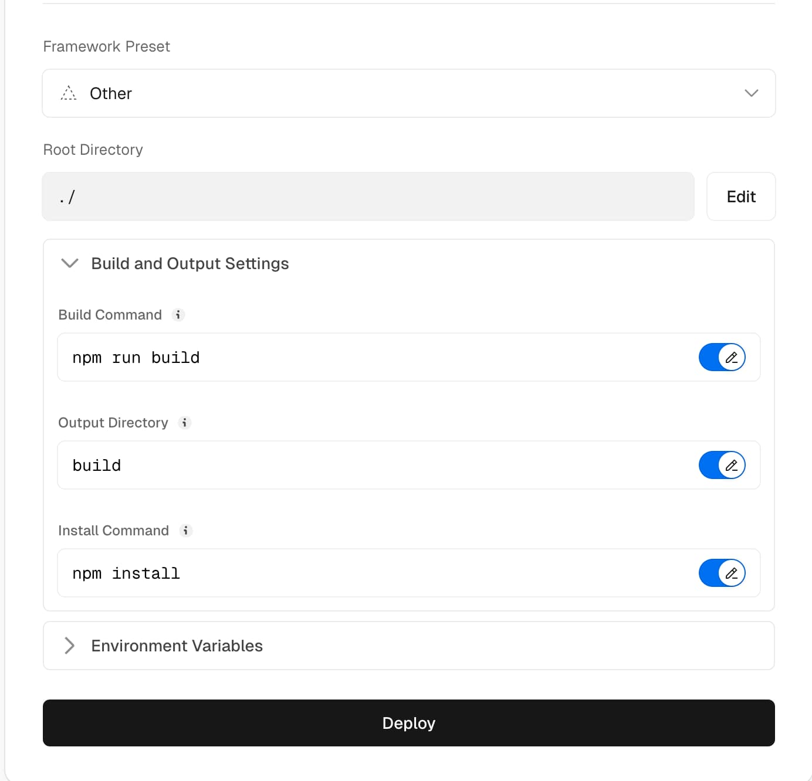

# Squoosh-Memos

[Squoosh](https://github.com/GoogleChromeLabs/squoosh) 是一个强大的图片压缩 Web 应用，支持多种格式的图片压缩和优化。

本项目基于 Squoosh ，添加 Memos 后端 API， 将 压缩-下载，变成 压缩-上传（Memos）

## 主要功能

### 🖼️ 多格式支持
- **编码格式**: AVIF, WebP, JPEG, PNG, JXL, WP2, QOI
- **预处理**: 旋转、调整大小、量化等
- **实时对比**: 左右分屏对比压缩效果

### 📊 智能压缩
- 本地处理，保护隐私
- 实时预览压缩效果
- 详细的文件大小对比
- 压缩率百分比显示

### ☁️ Memos 集成
- 一键上传到 Memos 后端
- 支持自定义 API 配置
- 自动生成文件名
- 上传状态实时显示

### ⚙️ 灵活配置
- 可调节压缩参数
- 支持批量处理
- 设置本地保存
- 响应式设计

## 隐私保护

本项目不会将您的图片发送到第三方服务器。所有图片压缩都在本地进行，保护您的隐私。

## 使用方法

### 1. 基本压缩
1. 上传图片到左侧
2. 在右侧选择编码格式和参数
3. 实时查看压缩效果
4. 点击下载或上传按钮

### 2. Memos 上传配置
1. 点击右侧设置按钮 ⚙️
2. 输入 Memos 域名（如：memos.example.com）
3. 输入 API Token（无需 Bearer 前缀）
4. 保存设置

### 3. 上传到 Memos
1. 压缩完成后，点击右侧"上传到 Memos"按钮
2. 输入文件名（无需后缀）
3. 系统自动上传并创建 Memo

## 部署 （推荐vercel）

1. fork本项目
2. 打开 [vercel](https://vercel.com/)
3. 关联 github 账号，并导入本项目
4. 进行如下设置
   
   - Build Command -> npm run build
   - Output Directory -> build
   - Install Command -> npm install
  
     

## 开发

### 环境要求
- Node.js 18+
- npm 或 yarn

### 安装依赖
```sh
npm install
```

### 本地开发
```sh
npm run dev
```
访问 http://localhost:5000

### 构建生产版本
```sh
npm run build
```

## 支持的格式

### 编码器
- **AVIF**: 最新的图片格式，压缩率最高
- **WebP**: Google 开发的现代格式
- **JPEG**: 传统格式，兼容性最好
- **PNG**: 无损压缩，支持透明
- **JXL**: JPEG XL，下一代格式
- **WP2**: WebP2，WebP 的升级版
- **QOI**: 快速无损格式

### 预处理器
- **旋转**: 90°/180°/270° 旋转
- **调整大小**: 保持比例或自定义尺寸
- **量化**: 减少颜色数量

## 故障排除

### 上传失败
1. 检查 Memos API 配置
2. 确认 Token 权限
3. 查看浏览器控制台错误

### 压缩失败
1. 确认图片格式支持
2. 检查浏览器兼容性
3. 尝试刷新页面

### 性能问题
1. 大图片建议先调整尺寸
2. 关闭其他标签页释放内存
3. 使用现代浏览器

## 贡献

欢迎贡献代码！请查看 [贡献指南](/CONTRIBUTING.md)。

## 许可证

本项目基于 Apache 2.0 许可证开源。

## 相关链接

- [原版 Squoosh](https://squoosh.app)
- [Memos 文档](https://usememos.com/docs)
